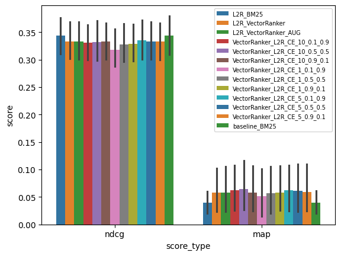
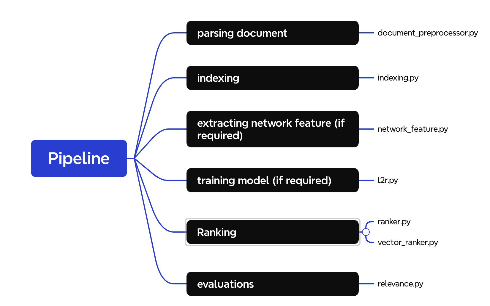

# Wiki-Search-Engine
A 200k-articles-based Wikipedia Search Engine using multiple NLP models, ranging from basic SVM models to high-level techniques. 

## The Current Best Performing Model in this project
### Streamline
- document_preprocessor: RegexTokenizer('\w+')
- l2r: True
- VectorRanker
- psedofeedback: {pseudofeedback_num_docs=10, pseudofeedback_alpha=0.5, pseudofeedback_beta=0.5}

### Performance
mymodel outperformed baseline(L2R+BM25) in terms of MAP 64% and comparable at ndcg (-3%).

| Dataset | MAP | NDCG |
|---------|-----|------|
| mymodel|   0.064(0.018,0.110)  | 0.331(0.296,0.366)     |
| L2R_BM25   | 0.039(0.018,0.060)    |  0.344(0.308,0.379)    |

In parentheses is interval range given 95% significance level

## Pipeline Overview

## Pipeline Details
### `document_preprocessor.py`
####  `Tokenizer`  class
A generic class for objects that turn strings into sequences of tokens. It is defaulted to lowcase all words and skip mulwiword expression match. 

Child classes include: `SplitTokenizer`, `RegexTokenizer` , `SpacyTokenizer`.

 <em> **Note that:** `RegexTokenizer` with pattern `\w+` is the defaulted tokenizer for this project. </em>

### `indexing.py`

#### `IndexType` class

Currently two types are supported by the system, `PositionalIndex` and `BasicInveredIndex` 

#### `InvertedIndex` class
attributes include:
- `statistics`: `vocab` corpus vocabulary tokens count, `total_token_count` # of total tokens including those filtered , `number_of_documents` , `unique_token_count`, `stored_total_token_count` # of total tokens excluding those filtered
- `vocabulary`: corpus vocabulary
- `document_metadata`: {docid:dict}, where dict includes `length`,`unique_tokens`,`tokens_count`
- `index`:{token:[(docid1,freq),(docid2,freq)]}

main functions include:
- `.remove_doc(*)`
- `.add_doc(*)`
- `.get_postings(*)`
- `.get_doc_metadata(*)`
- `.get_term_metadata(*)`
- `.get_statistics(*)`
- `.save()`
- `.load()`

 <em> **Note that:** `BasicInveredIndex` is the defaulted indexing method for this project. </em>

#### `Indexer` class
main functions include:
- `.create_index(*)`

### `network_features.py`

A class to generate network features, such as PageRank scores,HITS hub and authority scores. **ad-hoc network features files required**

main functions include:
- `.load_network(*)`
- `.calaulate_page_rank(*)`
- `.calculate_hits(*)`
- `.get_all_network_statistics(*)`: return dataframe with columns ['docid', 'pagerank', 'authority_score', 'hubscore']

### `l2r.py`

#### `L2RRanker` class
A class to generate L2RRanker model.

main attributes include:
- `dindex`: InvertedIndex, document body index
- `tindex`: InvertedIndex, document title index
- `tokenizer`:Tokenizer, document preprocessor
- `stopwords`: set[str], stopwords set
- `ranker`: Ranker
- `ftextractor`:L2RFeatureExtractor

main functions include:
- `.prepare_training_data(*)`
- `.train(*)`
- `.predict(*)`
- `.query(*)`

#### `L2RFeatureExtractor` class

A class to generate document features.

main attributes include:
- `dindex`: InvertedIndex, document body index
- `tindex`: InvertedIndex, document title index
- `tokenizer`:Tokenizer, document preprocessor
- `stopwords`: set[str], stopwords set
- `doc_category_info`:external imported doc_category_info dictionary that map document id to a list of categories.
- `docid_to_network_features`:dict, generated by [netword_feature.py](network_features.py)
- `ranker`: Ranker
- `ftextractor`:L2RFeatureExtractor
- `dindex_bm25`: BM25 ranker for document body index
- `dindex_piv`: PivotedNormalization ranker for document body index
- `ce_scorer`: cross encoder

main functions include:
- `.generate_features(*)`

#### `LambdaMART` class

Initialize and train L2R model

### `ranker.py`
#### `Ranker` class
This class is responsible for generating a list of documents for a given query, ordered by scores.

main attributes include:
- `index`
- `document_preprocessor`
- `stopwords`
- `scorer`

main functions include:
- `.query(*)`

#### `RelevanceScorer` class

The parent class for scorers. The child classes include: ` WordCountCosineSimilarity`,`DirichletLM`, `BM25`, `PivotedNormalization`,`TF_IDF`

main functions include:
- `.score(*)`

#### `CrossEncoderScorer` class

An object that uses cross-encoder to compute relevance of a document and query

### `VectorRanker.py`

#### `VectorRanker` class

Initialize a vectorranker and set up query function.

main attributes include:
- `biencoder_model`:the name of huggingface model to initialize a 'SentencTransformer'
- `encoded_docs`: A matrix where each row is an already-encoded document
- `row_to_docid`:A list mapping each row in the matrix to document id

main functions include:
- `.query(*)`

#### `relevance.py`

main functions include:
- `map_score()`
- `ndcg_score()`
- `run_relevance_test()`

